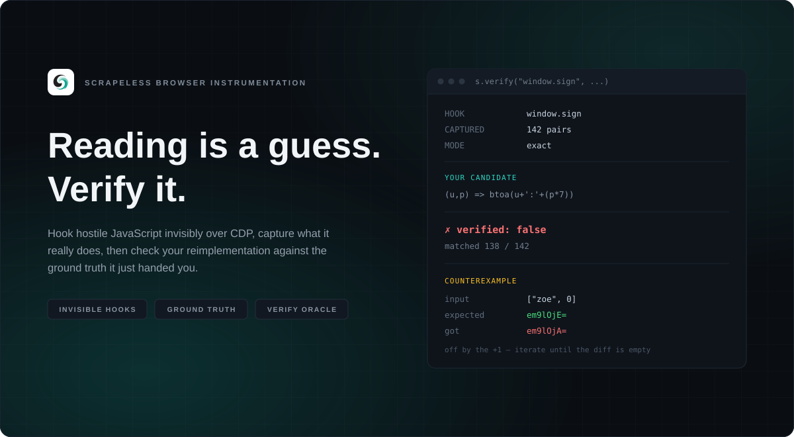

# Scrapeless Browser Instrumentation

<p align="center">
  
  
  
  
  
  <a href="https://github.com/scrapeless-ai/scrapeless-browser-instrumentation/actions/workflows/ci.yml"></a>
</p>

<p align="center"></p>

<p align="center"><b>Invisible CDP hooks, captured ground truth, and an oracle that proves your reimplementation wrong</b></p>

<p align="center">
  <a href="https://scrapeless.com">Scrapeless</a> ·
  <a href="#why">Why</a> ·
  <a href="docs/recipes.md">Recipes</a> ·
  <a href="docs/architecture.md">Architecture</a> ·
  <a href="CONTRIBUTING.md">Contributing</a>
</p>

---

`sbi` takes apart the client-side JavaScript that does not want to be taken apart — anti-bot, captcha, fingerprinting, fraud and payment SDKs — from **outside** the page, over the Chrome DevTools Protocol, in a remote **Scrapeless Scraping Browser**.

Nothing is wrapped, replaced or injected. The function a page defends is the same object after you attach as it was before, so `fn.toString()` checks, Proxy traps and monkeypatch detectors have nothing to find. You watch what that function actually does with real inputs, across the whole target graph — page, workers, iframes — then hand `sbi` your reimplementation of it. The oracle runs your version against the captured ground truth and tells you, with concrete counterexamples, precisely where you got it wrong.

## Installation

```bash
pip install -e .                       # or: pip install -r requirements.txt (just websockets)
pip install -e '.[mcp]'                # optional: adds the MCP server dependency
export SCRAPELESS_API_TOKEN=...        # from your Scrapeless dashboard
```

Requires Python 3.10+. Node is only needed for two optional features: offline trace re-verification and static deobfuscation (`sbi/deobfuscate/deobf.py`).

## Quick start

```bash
python -m sbi https://target/ --seconds 10 --grep token --out trace.json
python -m sbi https://target/ --coverage --functions sign
python -m sbi https://target/ --hook 'window.sign' --capture-returns
python -m sbi https://target/ --heapdiff-action "window.checkout()" --report report.md
python -m sbi https://target/ --repl
```

```python
import sbi
with sbi.attach("https://target/") as s:
    s.hook("window.sign", capture_returns=True, label="sign")   # observed (input -> output) pairs
    s.wait(3)
    s.verify("window.sign", "(u,p)=>btoa(u+':'+(p*7+1))",       # your reimplementation
             label="sign", fresh_inputs=[["zoe", 0]])
    # -> {"verified": false, "mismatches": [{"input": ["zoe",0], "expected": "...", "got": "..."}]}
```

## Why

An LLM reading obfuscated JavaScript is right about syntax almost always and right about behaviour maybe three times in five — [JsDeObsBench](https://github.com/Ch3nYe/JsDeObsBench) measured it: **~97% syntactic fidelity, ~61% semantic fidelity**. Reading is a hypothesis, never a fact.

`sbi` is the part that checks it. You observe ground truth at a runtime boundary — a decoder, a signer, a crypto call — and form a candidate reimplementation. `verify()` runs the candidate in an isolated page that cannot see the real function, against the captured ground-truth corpus and against the live target for fresh inputs, and returns a structured diff with concrete counterexamples. Iterate until the diff is empty. Nothing is inferred from source; everything is checked against a live function object over CDP.

That checking loop needed a much bigger surface than a single hook-and-verify cycle: the whole target graph (page, workers, iframes), heap diff, live patch, coverage-guided hooking, WASM recon, Frida-style agent scripting, environment control (network throttling, geolocation, dialogs), and 80 MCP tools so an agent can drive all of it directly — running against a **remote, cloud-hosted browser** (the Scrapeless Scraping Browser) rather than a local Chrome process.

## Capability surface

- **Remote-first**: transport is the Scrapeless CDP websocket (or any CDP endpoint) — no local browser to launch, no debugging port for the page to discover. Proxy/geo/fingerprint choices are Scrapeless query params; browser stealth is Scrapeless's job, not sbi's.
- **Async core, sync face**: a `websockets` asyncio loop runs in a background thread behind an ordered event-pump thread, with a `flush_events()` ordering contract — hooks stay deterministic under concurrent pauses.
- **Offline verification**: `trace.offline_verify` re-checks a saved corpus in a bare Node process — no browser session, no network, useful in CI.
- **Beyond hook-and-verify**: heap diff, live patch, coverage-guided hooking, closure index, dataflow follow, VM tracing, stealth audit, multiple comparison modes, an on-disk artifact store with sanitize/compare/replay, WASM recon, Frida-style agent scripting, environment control (throttle/geolocation/dialogs/cookies), and markdown reports — see [Architecture](#architecture) and [docs/recipes.md](docs/recipes.md) for the full set.

## How it connects to Scrapeless

The Scrapeless Scraping Browser exposes **plain CDP** on a websocket, so the entire instrumentation happens at the protocol level — no local browser, no debugging port for the page to discover, and Scrapeless's own fingerprint/residential-proxy stack stays fully in charge:

```
wss://browser.scrapeless.com/api/v2/browser?token=...&proxyCountry=US&sessionTTL=300
```

`api.endpoint()` assembles it (token from `$SCRAPELESS_API_TOKEN` by default); any other CDP endpoint works too — `--cdp wss://...` for another gateway, or `--cdp http://127.0.0.1:9222` for local Chrome (auto-resolves `webSocketDebuggerUrl`). The cloud session lives exactly as long as the websocket (plus TTL), which makes "close = evidence gone" the default; `save()` writes the artifact first — and `save(..., sanitize=True)` redacts it for sharing.

## The stealth model

| Mechanism | How | Visible to the page? |
|---|---|---|
| **Hooks** | `Debugger.setBreakpointOnFunctionCall` on the live function object | **No** — never wrapped or replaced; `fn.toString()`, Proxy traps and monkeypatch detectors see nothing; `evaluateOnCallFrame` reads the real closure |
| **Return capture** | Breakpoints on the function's own `return` locations; args (in scope) + `callFrames[0].returnValue` read atomically | **No** |
| **Target graph** | Flat-mode `Target.setAutoAttach` cascading to workers/OOPIFs; new targets instrumented *before* release | **No** |
| **Network/WS capture** | Network domain events + `getResponseBody` | No |
| **Console capture** | `Runtime.consoleAPICalled` / `Runtime.exceptionThrown` handlers on the already-enabled Runtime stream | **No** — nothing new is enabled; the events were already flowing, the observer just keeps the tape |
| **Dialogs** | `Page.javascriptDialogOpening` recorded to a capped tape; optional auto-accept/dismiss via `Page.handleJavaScriptDialog` | Record: **No**. Auto-answer: behaviourally visible — the dialog gets answered and `confirm()`/`prompt()` return the policy's choice |
| **Input / click / typing** | `Input.dispatchMouseEvent` / `Input.insertText` / `Input.dispatchKeyEvent` — plain CDP, no Puppeteer/Playwright | **No** as a mechanism — events are trusted (`isTrusted: true`); the page sees a normal click |
| **Interception** | `Fetch` domain: requests pause on the pump thread, then `fulfillRequest` / `failRequest` / `continueRequest` | **No** — the page only sees the response; a mock is indistinguishable from the real server |
| **Heap search / diff / origin / coverage / function index** | `HeapProfiler` snapshots (reverse-edge retainers), allocation sampling, `Profiler` precise coverage | No (snapshot forces a pause — perf only) |
| **Live patch** | `Runtime.callFunctionOn` on the object resolved from a snapshot id | Invisible as a mechanism; the *value change* is behaviourally observable (that's the proof) |
| **Boundary probes** (`crypto`, `eval`, `net`) | Main-world wrappers installed before any page script runs (masqueraded `toString`/`name`) | **Yes — this is patching.** `Function.prototype.toString.call(wrapper)` bypasses the masquerade; use probes to observe, hooks to be stealthy |
| **Oracle** | Candidate runs in a **private** page attached with Runtime only | No |

`s.audit()` re-checks every hook after the fact: toString identity and own-property count against the baseline recorded at hook time. Full accounting in [docs/threat-model.md](docs/threat-model.md).

## Architecture

Seven subpackages, each one responsibility. `api.py` is the only hub: every
capability module is pure functions over `(cdp, session_id, ...)`, and `Session`
is the thin facade that wires them together.

```
sbi/
  __init__.py       package exports: attach, Session, endpoint, __version__
  __main__.py       the `python -m sbi` CLI
  api.py            Session facade + endpoint builder  ← the hub
  mcp_server.py     80 MCP tools for agents
  doctor.py         readiness self-check: deps, token, endpoint, browser probe

  core/             transport + target graph
    cdp.py          CDP over the Scrapeless websocket; sync API; ordered event
                    pump (handlers may block — read frame, then resume)
    engine.py       flat auto-attach cascade, session registry, isolated
                    private pages, scriptParsed registry, blackboxing

  hooks/            getting instrumentation onto live code
    tracer.py       invisible hooks + (input, output) corpus pairs via return locations
    probes.py       crypto.subtle / eval / Function / fetch / XHR boundary recorders
    agent.py        Frida-style agent scripting: send/rpc bridge, per-target install
    audit.py        post-hook integrity check (stealth audit)

  verify/           the oracle — nothing inferred is trusted
    oracle.py       verify(): corpus + fresh live inputs vs candidate run isolated
    matching.py     comparison modes: exact / loose_string / numeric / time_tolerant

  analysis/         finding and understanding code
    heap.py         heap snapshot search by value/constructor/regex + retainer paths
    heapdiff.py     snapshot -> action -> snapshot: what the action allocated
    patch.py        live patch of closure-held objects (callFunctionOn)
    coverage.py     precise coverage: which functions actually ran, how often
    functions.py    closure index with url + [[FunctionLocation]]
    dataflow.py     follow a producer's outputs to the objects that hold them
    origin.py       allocation sampling with stacks

  deobfuscate/      making obfuscated code readable
    deob.py         string-table dumps by driving the real decoder; VM trace helpers
    deobf.py        static deobfuscation bridge: webcrack + prettier (node)
    wasm.py         wasm recon: enumerate, dump, disassemble, meta

  page/             page environment: observe and control
    network.py      requests, responses, bodies, websocket frames; grep
    console.py      console + uncaught-exception tape (Runtime-domain observer)
    dialogs.py      JS dialog tape + optional auto-accept/dismiss
    intercept.py    per-session Fetch-domain request mock/abort/passthrough
    control.py      screenshots, trusted input events, cookies/storage
    emulation.py    per-session UA / locale / timezone / viewport overrides

  artifacts/        persistence, comparison, reporting
    trace.py        save/load JSON artifacts; offline re-verification via bare Node
    replay.py       re-establish a saved trace's hooks on a fresh session
    compare.py      diff two artifacts: corpora/hooks/network regressions
    store.py        on-disk artifact store with cross-artifact search
    sanitize.py     redact secrets from artifacts before sharing
    report.py       markdown report from a session/artifact
```

Deep-dive: [docs/architecture.md](docs/architecture.md).

### The hook path, in one paragraph

`Runtime.evaluate` resolves the target expression to a live function `objectId`. `Debugger.setBreakpointOnFunctionCall` arms a breakpoint **on the object** — nothing in page JS changes. Each pause reads `arguments` via `Debugger.evaluateOnCallFrame`; for `capture_returns=True`, the function's `[[FunctionLocation]]` feeds `getPossibleBreakpoints(restrictToFunction)`, every `return` location gets a `Debugger.setBreakpoint`, and the resulting pause exposes both the in-scope args and `callFrames[0].returnValue` — one atomic `(input, output)` pair per call. Then `Debugger.resume`. The page runs unmodified at full speed in between.

### String tables: ask the decoder, don't read it

`obfuscator.io` rotates its string array at load, so the order you read in the
source is not the order the program uses. Any reimplementation transcribed from
source is therefore wrong in a way that looks right. The decoder itself is pure,
so run it:

```python
dump = s.strings("window._0x4c2f", n=64)      # drives the page's own decoder
# -> {'values': {0: 'craig', 1: 'patched', ...}}   the runtime mapping, as ground truth
```

## Finding what to hook

```python
ran = s.coverage("take")            # after coverage("start") + reproducing the behaviour
fns = s.functions(contains="sign")  # every live closure matching, with url + location
d = s.heapdiff(action="clickPay()") # what the action allocated, and who holds it
s.auto_hook(top=5)                  # hook the functions that actually ran — by live
                                    # object, so window-unreachable closures are covered
s.trace_value("tok_9f27")           # one value, full journey: hooks + pairs + network + heap
s.watch("window.token")             # poll-and-record a mutating value's timeline
s.new_page("https://target/app2")   # additional instrumented pages
s.console()                          # console + uncaught exceptions: anti-debug tells
s.intercept("*/api/config", body='{"debug":1}')   # mock endpoints, watch the SDK react
s.click_element("#checkout")         # trusted input events, no Puppeteer
s.screenshot("evidence.png")         # PNG proof for the report
```

Coverage-guided hooking, the closure index, value-first origin tracing and worker targeting are covered in [docs/recipes.md](docs/recipes.md) (14 recipes) — and encoded as agent skills below. On direct-CDP sessions to *local* headless Chrome, `sbi` also masks the `HeadlessChrome` UA + client hints per session (on Scrapeless, the gateway's fingerprint stack owns that).

## MCP server (from Claude Code or any MCP client)

```bash
pip install mcp
claude mcp add sbi -- python -m sbi.mcp_server      # run from the repo checkout
```

80 tools: `sbi_attach`, `sbi_targets`, `sbi_hook`, `sbi_captures`, `sbi_verify` (with comparison modes), `sbi_replay`, `sbi_sanitize`, `sbi_objects`, `sbi_object`, `sbi_origin`, `sbi_strings`, `sbi_probe`, `sbi_grep`, `sbi_eval`, `sbi_heapdiff`, `sbi_patch`, `sbi_functions`, `sbi_auto_hook`, `sbi_coverage`, `sbi_follow`, `sbi_vm`, `sbi_watch`, `sbi_trace_value`, `sbi_audit`, `sbi_blackbox`, `sbi_new_page`, `sbi_console`, `sbi_cookies`, `sbi_storage`, `sbi_screenshot`, `sbi_click`, `sbi_type`, `sbi_intercept`, `sbi_clear_intercepts`, `sbi_scripts`, `sbi_source`, `sbi_dump_scripts`, `sbi_report`, `sbi_save`, `sbi_close`. Full reference: [docs/mcp-tools.md](docs/mcp-tools.md).

Five agent skills teach the loops:

- `skills/verify-reimplementation/` — hypothesize → capture → verify until the diff is empty
- `skills/find-and-hook/` — locate the function behind an observable behaviour
- `skills/crack-string-table/` — defeat string arrays, key-dependent decoders and bytecode VMs
- `skills/drive-and-observe/` — environment-control loop: network throttling, geolocation, cookies, dialogs
- `skills/wasm-recon/` — WebAssembly recon loop: enumerate, dump, disassemble, meta

## Testing

```bash
python -m unittest discover -s tests -v
```

Everything is offline and tokenless by default: a fake in-process CDP server exercises the real client stack end to end (attach → hook → atomic pair capture → oracle verify/reject → heapdiff/patch/coverage/functions/follow/audit → save → Node offline verify), the page-side probe snippets are executed under real Node, and the pure modules (matching/compare/artifacts/replay/sanitize) have their own suites. ~90 tests, ~15s.

**Live validation** — the whole feature set is also exercised against a real Chromium:

```bash
python scripts/live_battery.py                 # one command: finds Chrome/Edge, runs every example
                                               # + tests.test_live against a throwaway headless Chromium
chrome --headless=new --remote-debugging-port=9222 --user-data-dir=%TEMP%\sbi
python -m unittest tests.test_live -v          # end-to-end tests, skip without a browser
python -m unittest tests.test_mcp -v           # all 80 MCP tools over real stdio vs live Chrome
python examples/selftest.py                    # all 16 examples: PASS against real Chrome
```

The live pass caught and fixed real bugs the offline suite couldn't see: duplicate flat CDP sessions for one target double-delivering pauses (fixed via targetId dedup + breakpoint-id routing), arrow functions having no `arguments` binding (args now recovered from the paused frame's scope chain), string heap nodes not resolvable as live objects (search now exposes the holder object), and worker hook timing. See [examples/README.md](examples/README.md) for the live battery index.

```bash
python examples/selftest.py        # hook invisibility proof + live arg capture
python examples/oracle_demo.py     # oracle rejects the wrong reimpl, accepts the right one
python examples/heap_diff.py       # what an action allocated, with holders
python examples/live_patch.py      # closure state patched in place, behaviour flips
python examples/vm_trace.py        # bytecode VM -> steps + histogram -> verified semantics
```

## Documentation

- [docs/recipes.md](docs/recipes.md) — 14 reverse-engineering recipes
- [docs/architecture.md](docs/architecture.md) — transport/concurrency, hook lifecycle, oracle isolation
- [docs/threat-model.md](docs/threat-model.md) — what the target can and cannot see, per mechanism
- [docs/mcp-tools.md](docs/mcp-tools.md) — full MCP tool reference
- [CONTRIBUTING.md](CONTRIBUTING.md) — dev setup, adding capabilities, style, release checklist

## License

[MIT](LICENSE) — © 2026 sbi contributors.

## Credits

**[ghostwire](https://github.com/sofianeelhor/ghostwire)** (sof) is this project's
direct ancestor. `sbi` began as a port of it to the Scrapeless cloud browser and
still carries parts of its oracle and engine largely intact; those portions remain
under ghostwire's MIT copyright, recorded in [LICENSE](LICENSE). The transport,
target graph, and the great majority of the capability surface documented above
were written for `sbi`.

**[Wirebrowser](https://github.com/fcavallarin/wirebrowser)** (fcavallarin)
established the technique both projects rest on: hooking via a CDP breakpoint on
the live function object instead of monkeypatching it, plus BDHS-style origin
tracing.

**[JsDeObsBench](https://github.com/Ch3nYe/JsDeObsBench)** (Chen et al., CCS'25,
[arXiv:2506.20170](https://arxiv.org/abs/2506.20170)) supplies the measurement
quoted in [Why](#why) — ~97% syntactic against ~61% semantic fidelity. That gap
is the entire reason `verify()` exists.

Use only against targets you are authorized to test.
